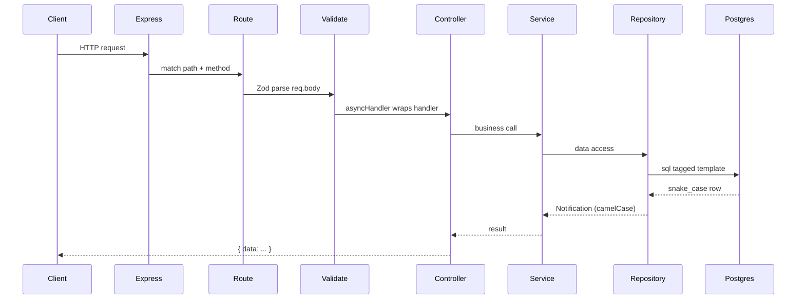
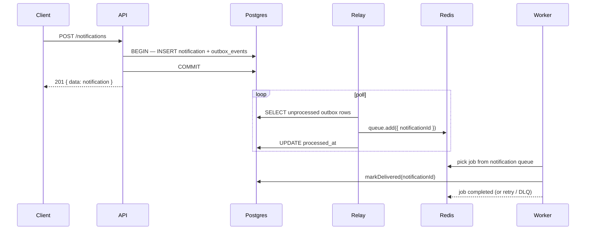

# Architecture

Async Notification System — an Express + TypeScript API backed by PostgreSQL and Redis (BullMQ).

> Setup and run instructions: [README.md](./README.md)

## Tech stack

| Layer      | Choice                                                             |
| ---------- | ------------------------------------------------------------------ |
| Runtime    | Node.js (ESM)                                                      |
| HTTP       | Express 5                                                          |
| Language   | TypeScript                                                         |
| Database   | PostgreSQL via [postgres.js](https://github.com/porsager/postgres) |
| Validation | Zod                                                                |
| Logging    | Winston (files) + Morgan + `console.*` (terminal)                  |
| Queue      | BullMQ + Redis                                                     |
| Tests      | Vitest + Supertest                                                 |

## Project structure

```
src/
├── config/           # env validation, DB pool, Redis, logger
├── controllers/      # HTTP handlers (req/res only)
├── db/
│   ├── migrate.ts    # migration runner
│   ├── repositories/ # SQL data access (notification + outbox)
│   └── schemas/      # Zod schemas, domain types, row mappers
├── middlewares/      # global error handler
├── routes/v1/        # route wiring + middleware
├── services/         # business logic
├── queues/           # BullMQ queues (main + DLQ) + Bull Board
│   ├── notification.queue.ts
│   └── notification.dlq.queue.ts
├── relay/            # outbox relay (poll DB → enqueue Redis)
│   └── outbox.relay.ts
├── relay.ts          # relay process entry point
├── workers/          # BullMQ worker processor
├── worker.ts         # worker process entry point
└── utils/            # ApiError, asyncHandler, validate, sendData

migrations/           # numbered .sql migration files
test/                 # integration tests
logs/                 # rotated log files (gitignored)
```

## Request flow

A typical API request passes through these layers in order:



### Example: `POST /api/v1/notifications`

```
index.ts            app.use("/api/v1", v1Router)
routes/v1/          v1Router.use("/notifications", notificationRouter)
notification.route  validate(createNotificationSchema)
                    asyncHandler(notificationController.createNotification)
controller          notificationService.createNotification(req.body)
service             notificationRepository.createNotificationWithOutboxEvent(data)
repository          sql.begin: INSERT notification + INSERT outbox_events (atomic)
service             logger.info("Notification created: …")
controller          sendData(res, notification, 201)   ← 201 before delivery finishes

relay.ts            separate process (pnpm dev:relay)
outbox.relay        fetchPendingEvents → notificationQueue.add → markProcessed
worker.ts           separate process (pnpm dev:worker)
notification.worker processJob → markNotificationAsDelivered
repository          UPDATE … SET is_delivered = TRUE
```

## Async delivery (transactional outbox + BullMQ)

Delivery runs across **three separate processes**. The API never talks to Redis directly — it writes intent to Postgres; the relay publishes to BullMQ.

| Process | Entry | Script | Role |
| ------- | ----- | ------ | ---- |
| API | `src/index.ts` | `pnpm dev` | HTTP, atomic notification + outbox write |
| Relay | `src/relay.ts` | `pnpm dev:relay` | Poll outbox, enqueue jobs to Redis |
| Worker | `src/worker.ts` | `pnpm dev:worker` | Consume jobs, mark delivered |

### End-to-end flow



### Transactional outbox

**Table:** `outbox_events` (migrations `003`, `004`)

| Column | Purpose |
| ------ | ------- |
| `aggregate_id` | Business ID (notification UUID) |
| `aggregate_type` | Domain type (`notification`) |
| `event_type` | Handler routing (`send-notification`) |
| `payload` | JSONB job data (`{ notificationId }`) |
| `processed_at` | `NULL` until relay publishes; partial index on unprocessed rows |

Migration `004` drops the FK to `notifications` so the outbox stays generic, and adds `idx_outbox_events_unprocessed` for relay polling.

**Write path** — `notificationRepository.createNotificationWithOutboxEvent()`:

1. `sql.begin` — single transaction
2. `insertNotification(tx, …)` — shared helper accepting `Sql | TransactionSql`
3. `insertOutboxEvent(tx, …)` — from `outbox.repository.ts`; use `sql.json(payload)` for JSONB
4. Return mapped `Notification`

The service does **not** call `notificationQueue.add()`.

**Relay path** — `outboxRepository.fetchPendingEvents()` → publish → `markProcessed()`:

- Fetch and publish happen **outside** any DB transaction
- Redis/BullMQ is never called inside `sql.begin` (long locks + partial-failure risk)
- **At-least-once delivery** — if relay crashes after enqueue but before mark, the row is retried; `jobId: aggregateId` dedupes duplicate enqueues

**Relay enqueue opts** (same as before, now in `outbox.relay.ts`):

- `attempts: 3` and exponential backoff (`2s` base delay)
- `jobId: event.aggregateId` (notification UUID)

### Queues

| Queue | Redis name | File | Purpose |
| ----- | ---------- | ---- | ------- |
| Main | `notification` | `queues/notification.queue.ts` | Jobs waiting to be delivered |
| DLQ | `notification-dlq` | `queues/notification.dlq.queue.ts` | Jobs that exhausted all retries |

Constants live in `src/utils/constants.ts` (`NOTIFICATION_QUEUE_NAME`, `SEND_NOTIFICATION_JOB_NAME`, etc.).

**Job IDs vs payload:** BullMQ `job.id` is an auto-increment queue counter (`"1"`, `"2"`, …). Business identity is `job.data.notificationId`.

### Worker processor

`src/workers/notification.worker.ts`:

1. Optionally throw (~50% chance) when `ENABLE_FAILURE_MODE` is on — triggers BullMQ retry/backoff
2. Call `notificationService.markNotificationAsDelivered(notificationId)`
3. Optionally sleep (`ENABLE_DELAY_MODE` + `DELAY_MODE_DELAY`) **after** a successful DB update — useful for watching in-flight jobs in Bull Board
4. On `failed` after max attempts → `failed` handler copies job metadata into the DLQ queue

Import sibling queue files directly — **never** `import from "./index.js"` inside a module that `index.ts` re-exports (circular dependency breaks the worker silently).

### Outbox repository

`src/db/repositories/outbox.repository.ts`:

| Method | Purpose |
| ------ | ------- |
| `insertOutboxEvent(tx, data)` | Insert row inside an existing transaction |
| `fetchPendingEvents(batchSize)` | `SELECT` unprocessed rows ordered by `created_at` |
| `markProcessed(id)` | Set `processed_at` after successful enqueue |

### Dead letter queue (DLQ)

When a job fails all retry attempts, the worker's `failed` handler pushes a new job to `notification-dlq` with:

- `originalJob` — id, name, data, opts from the failed job
- `failure` — reason, stack trace, attempts, timestamp

The DLQ is a parking lot for inspection/replay — no DLQ worker by default. Failed jobs also remain visible on the main queue's **Failed** tab in Bull Board until cleaned up.

### Bull Board (dev)

Mounted at `/admin/queues` from `notification.queue.ts`. Shows both `notification` and `notification-dlq`. Read-only visibility into Redis job state — data is stored under `bull:notification:*` and `bull:notification-dlq:*`.

Do not expose in production without auth.

## Layer responsibilities

### Routes (`src/routes/`)

- Wire HTTP paths to middleware and handlers.
- No business logic.
- Own middleware ordering: `validate` → `asyncHandler(controller)`.

### Controllers (`src/controllers/`)

- Translate HTTP ↔ service calls.
- Read from `req` (body, params, query); write via `sendData()`.
- Stay thin — no SQL, no heavy logic.
- Exported as namespaced modules: `notificationController.createNotification`.

### Services (`src/services/`)

- Business rules and orchestration.
- Throw `ApiError` for expected failures (not found, conflict, etc.).
- Log meaningful business events here (`logger.info`, `logger.warn`).
- Exported as namespaced modules: `notificationService.createNotification`.

### Repositories (`src/db/repositories/`)

- Raw SQL via `postgres.js` tagged templates.
- Short method names scoped by namespace: `notificationRepository.create`.
- Return domain types via mappers — never leak snake_case rows upward.
- Let DB errors bubble; translate to `ApiError` in the service only when needed.
- **Transactions:** pass `Sql | TransactionSql` to helpers used inside `sql.begin`; use `sql.json()` for JSONB columns.
- **Outbox writes** live in `outbox.repository.ts`; **atomic notification + outbox** is orchestrated in `notificationRepository.createNotificationWithOutboxEvent()`.

### Schemas (`src/db/schemas/`)

- **Zod schemas** — app/API shape (camelCase): `notificationSchema`, `createNotificationSchema`, `outboxEventSchema`.
- **Row types** — DB shape (snake_case): `NotificationRow`, `OutboxEventRow`.
- **Mappers** — `toNotification(row)`, `toOutboxEvent(row)` map row → domain and validate via Zod.

## API response format

### Success

Always wrapped in `{ data: ... }`:

```json
{
  "data": {
    "id": "uuid",
    "title": "Hello",
    "content": "World",
    "isSeen": false,
    "isDelivered": false,
    "createdAt": "2026-05-26T12:00:00.000Z"
  }
}
```

Use `sendData(res, payload, statusCode)` from `src/utils/apiSuccess.ts`.

### Error

Always wrapped in `{ error: ... }`:

```json
{
  "error": {
    "message": "Invalid request payload",
    "details": { "title": ["Required"] }
  }
}
```

- **`ApiError`** — intentional errors with HTTP status (400, 404, 409, …).
- **Anything else** — logged as `logger.error`, client gets generic 500.

## Error handling

Do **not** scatter try/catch through controllers and services.

```
asyncHandler  →  catches async throws  →  next(err)
errorHandler  →  logger.error(err)  →  JSON response
```

| Layer             | Pattern                                                      |
| ----------------- | ------------------------------------------------------------ |
| Controller        | Wrapped in `asyncHandler`; no try/catch                      |
| Service           | `throw new ApiError(status, message)` for business errors    |
| Repository        | Let `PostgresError` bubble unless service translates it      |
| Service try/catch | Only when mapping a low-level error to a specific `ApiError` |

Validation middleware (`validate`) parses `req.body` with Zod and throws `ApiError(400, ...)` on failure.

## Database

### Connection

- Pool created in `src/config/db.ts` via `postgres(url, { max })`.
- `postgres()` is lazy — no TCP until the first query.
- `connectDb()` runs `SELECT current_database()` at startup to fail fast.
- Called from `bootstrap()` in the API, relay, and worker entry points.

### Naming convention

| Where            | Convention                    | Example                 |
| ---------------- | ----------------------------- | ----------------------- |
| Postgres columns | snake_case                    | `is_seen`, `created_at` |
| TypeScript / API | camelCase                     | `isSeen`, `createdAt`   |
| Mapping          | `toNotification()` in schemas | single place per entity |

Do not use `postgres.camel` transform. Keep SQL readable; map explicitly.

### Migrations

SQL files in `migrations/` follow `{number}_{description}.sql`:

```
001_create_notiiciation.sql
002_add_is_delivered_to_notifications.sql
003_create_outbox_events.sql
004_fix_outbox_tight_coupling.sql
```

Run with:

```bash
pnpm migration:run
```

The runner:

1. Ensures a `schema_migrations` tracking table exists.
2. Sorts `.sql` files alphabetically.
3. Skips already-applied versions.
4. Runs each new migration inside a transaction.
5. Records the version in `schema_migrations`.

Write plain SQL — no trailing commas, use `(` not `{` for table definitions. Each migration runs once; avoid `IF NOT EXISTS` on columns unless you have a specific reason.

## Logging

Three channels by design — terminal for live ops, files for audit:

| Channel | Output | Used for |
| ------- | ------ | -------- |
| **Morgan** | Terminal | HTTP access logs (API only) |
| **`console.log` / `console.error`** | Terminal / container stdout | Process lifecycle, job progress, batch published — human-readable, easy to scan |
| **Winston `logger.*`** | Files only | Business events, errors, audit trail |

Do **not** duplicate every console line to logger. Console = operational; logger = persistence.

### Log files

Rotated daily via symlinks:

```
logs/
├── combined.log  →  all levels
├── info.log      →  info and above
└── error.log     →  errors only
```

### Log format

```
2026-05-26T17:44:09.957Z [worker] [src/workers/notification.worker.ts:86] ERROR: Job 3 attempt 2/3 failed: …
```

- `[service]` — from `SERVICE_NAME` env (`api`, `worker`, `relay`); set in `package.json` scripts
- `[file:line]` — caller location from stack trace
- ISO timestamps for info/warn/error; epoch ms for debug

Filter shared logs: `grep '\[relay\]' logs/combined.log`

### Where to log

| Layer | `console.*` | `logger.*` |
| ----- | ----------- | ---------- |
| API bootstrap | Server listening, fatal startup | `logger.error` on bootstrap failure |
| Relay | Polling started, batch published, stopped | Batch size (`info`), relay errors (`error`) |
| Worker | Job progress, ready, shutdown | Job completed (`info`), retries (`error`), DLQ (`warn`) |
| Service | No | Created, delivered (`info`) |
| `error.middleware` | No | Every error (`error`) |
| Repository | No | No — let errors bubble |
| Controller | No | No — keep HTTP layer thin |

## Configuration

Environment variables are validated at startup in `src/config/config.ts` with Zod. See `.env.example`.

| Variable            | Default       | Description                                       |
| ------------------- | ------------- | ------------------------------------------------- |
| `NODE_ENV`          | `development` | `development` \| `production` \| `test`           |
| `PORT`              | `8080`        | HTTP port                                         |
| `CORS_ORIGINS`      | (empty)       | Comma-separated origins; empty = allow all in dev |
| `LOG_DIR`           | `logs`        | Log file directory                                |
| `LOG_LEVEL`         | `warn`        | Min level in production (`debug` forced in dev)   |
| `SERVICE_NAME`      | `api`         | Log prefix: `api`, `worker`, or `relay`           |
| `DATABASE_URL`      | required      | Postgres connection string                        |
| `DATABASE_MAX_POOL` | `20`          | Max pool connections                              |
| `REDIS_URL`         | required      | Redis connection string (BullMQ)                  |
| `ENABLE_FAILURE_MODE` | `false`     | Worker randomly throws (~50%) to test retries/DLQ |
| `ENABLE_DELAY_MODE` | `false`       | Worker sleeps after DB update before completing   |
| `DELAY_MODE_DELAY`  | `500`         | Delay in ms when delay mode is on                 |

Dev/test flags (`config.flags`):

- **`isFailureModeEnabled`** — simulates delivery failures for retry/DLQ testing
- **`isDelayModeEnabled`** + **`delayModeDelay`** — slows worker to observe in-flight jobs in Bull Board

Invalid env vars print to stderr and exit before the server starts.

## Naming conventions

Each module exports named functions; barrel files re-export as namespaces:

```typescript
// db/repositories/notification.repository.ts
export const create = async (...) => { ... };

// db/repositories/index.ts
export * as notificationRepository from "./notification.repository.js";

// usage
notificationRepository.create(data);
```

| Layer      | Method naming       | Example                        |
| ---------- | ------------------- | ------------------------------ |
| Repository | Short verbs         | `create`, `findById`, `update` |
| Service    | Full business names | `createNotification`           |
| Controller | Match service       | `createNotification`           |

## Scripts

| Command | Description |
| ------- | ----------- |
| `pnpm dev` | API with hot reload (`SERVICE_NAME=api`) |
| `pnpm dev:relay` | Outbox relay with hot reload (`SERVICE_NAME=relay`) |
| `pnpm dev:worker` | Worker with hot reload (`SERVICE_NAME=worker`) |
| `pnpm migration:run` | Apply pending SQL migrations |
| `pnpm build` | Compile to `dist/` |
| `pnpm start` | Run compiled API |
| `pnpm start:relay` | Run compiled relay |
| `pnpm start:worker` | Run compiled worker |
| `pnpm test` | Run tests |
| `pnpm lint` | ESLint |
| `pnpm format` | Prettier |

## Adding a new feature (checklist)

1. **Migration** — `migrations/00N_description.sql`
2. **Schema** — Zod schema + row type + mapper in `src/db/schemas/`
3. **Repository** — SQL in `src/db/repositories/` (`null` when row not found)
4. **Service** — business logic + `logger.info` for business events
5. **Controller** — req/res handler in `src/controllers/`
6. **Route** — wire validate + asyncHandler in `src/routes/v1/`
7. **Async work** — outbox row in the same DB transaction as the write; relay enqueues; worker processes (keep all three processes separate)
