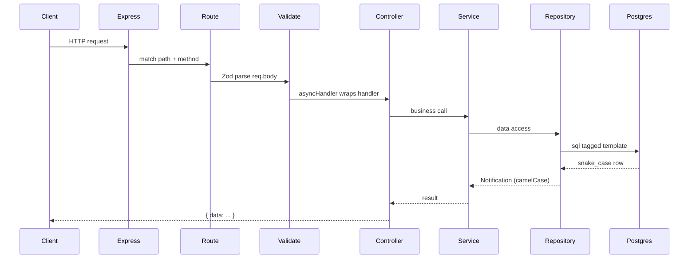

# Architecture

Async Notification System — an Express + TypeScript API backed by PostgreSQL and Redis (BullMQ).

> Setup and run instructions: [README.md](./README.md)

## Tech stack

| Layer      | Choice                                                             |
| ---------- | ------------------------------------------------------------------ |
| Runtime    | Node.js (ESM)                                                      |
| HTTP       | Express 5                                                          |
| Language   | TypeScript                                                         |
| Database   | PostgreSQL via [postgres.js](https://github.com/porsager/postgres) |
| Validation | Zod                                                                |
| Logging    | Winston (file-only) + Morgan (HTTP, terminal)                      |
| Queue      | BullMQ + Redis                                                     |
| Tests      | Vitest + Supertest                                                 |

## Project structure

```
src/
├── config/           # env validation, DB pool, logger
├── controllers/      # HTTP handlers (req/res only)
├── db/
│   ├── migrate.ts    # migration runner
│   ├── repositories/ # SQL data access
│   └── schemas/      # Zod schemas, domain types, row mappers
├── middlewares/      # global error handler
├── routes/v1/        # route wiring + middleware
├── services/         # business logic
├── queues/           # BullMQ queue (producer)
├── workers/          # BullMQ worker (consumer)
├── worker.ts         # worker process entry point
└── utils/            # ApiError, asyncHandler, validate, sendData

migrations/           # numbered .sql migration files
test/                 # integration tests
logs/                 # rotated log files (gitignored)
```

## Request flow

A typical API request passes through these layers in order:



### Example: `POST /api/v1/notifications`

```
index.ts          app.use("/api/v1", v1Router)
routes/v1/        v1Router.use("/notifications", notificationRouter)
notification.route  validate(createNotificationSchema)
                    asyncHandler(notificationController.createNotification)
controller        notificationService.createNotification(req.body)
service           notificationRepository.create(data)
repository        INSERT ... RETURNING *  →  toNotification(row)
controller        sendData(res, notification, 201)
```

## Layer responsibilities

### Routes (`src/routes/`)

- Wire HTTP paths to middleware and handlers.
- No business logic.
- Own middleware ordering: `validate` → `asyncHandler(controller)`.

### Controllers (`src/controllers/`)

- Translate HTTP ↔ service calls.
- Read from `req` (body, params, query); write via `sendData()`.
- Stay thin — no SQL, no heavy logic.
- Exported as namespaced modules: `notificationController.createNotification`.

### Services (`src/services/`)

- Business rules and orchestration.
- Throw `ApiError` for expected failures (not found, conflict, etc.).
- Log meaningful business events here (`logger.info`, `logger.warn`).
- Exported as namespaced modules: `notificationService.createNotification`.

### Repositories (`src/db/repositories/`)

- Raw SQL via `postgres.js` tagged templates.
- Short method names scoped by namespace: `notificationRepository.create`.
- Return domain types via mappers — never leak snake_case rows upward.
- Let DB errors bubble; translate to `ApiError` in the service only when needed.

### Schemas (`src/db/schemas/`)

- **Zod schemas** — app/API shape (camelCase): `notificationSchema`, `createNotificationSchema`.
- **Row types** — DB shape (snake_case): `NotificationRow`.
- **Mappers** — `toNotification(row)` maps row → domain and validates via `notificationSchema.parse()`.

## API response format

### Success

Always wrapped in `{ data: ... }`:

```json
{
  "data": {
    "id": "uuid",
    "title": "Hello",
    "content": "World",
    "isSeen": false,
    "isDelivered": false,
    "createdAt": "2026-05-26T12:00:00.000Z"
  }
}
```

Use `sendData(res, payload, statusCode)` from `src/utils/apiSuccess.ts`.

### Error

Always wrapped in `{ error: ... }`:

```json
{
  "error": {
    "message": "Invalid request payload",
    "details": { "title": ["Required"] }
  }
}
```

- **`ApiError`** — intentional errors with HTTP status (400, 404, 409, …).
- **Anything else** — logged as `logger.error`, client gets generic 500.

## Error handling

Do **not** scatter try/catch through controllers and services.

```
asyncHandler  →  catches async throws  →  next(err)
errorHandler  →  logger.error(err)  →  JSON response
```

| Layer             | Pattern                                                      |
| ----------------- | ------------------------------------------------------------ |
| Controller        | Wrapped in `asyncHandler`; no try/catch                      |
| Service           | `throw new ApiError(status, message)` for business errors    |
| Repository        | Let `PostgresError` bubble unless service translates it      |
| Service try/catch | Only when mapping a low-level error to a specific `ApiError` |

Validation middleware (`validate`) parses `req.body` with Zod and throws `ApiError(400, ...)` on failure.

## Database

### Connection

- Pool created in `src/config/db.ts` via `postgres(url, { max })`.
- `postgres()` is lazy — no TCP until the first query.
- `connectDb()` runs `SELECT current_database()` at startup to fail fast.
- Called from `bootstrap()` before `app.listen()`.

### Naming convention

| Where            | Convention                    | Example                 |
| ---------------- | ----------------------------- | ----------------------- |
| Postgres columns | snake_case                    | `is_seen`, `created_at` |
| TypeScript / API | camelCase                     | `isSeen`, `createdAt`   |
| Mapping          | `toNotification()` in schemas | single place per entity |

Do not use `postgres.camel` transform. Keep SQL readable; map explicitly.

### Migrations

SQL files in `migrations/` follow `{number}_{description}.sql`:

```
001_create_notiiciation.sql
002_add_is_delivered_to_notifications.sql
```

Run with:

```bash
pnpm migration:run
```

The runner:

1. Ensures a `schema_migrations` tracking table exists.
2. Sorts `.sql` files alphabetically.
3. Skips already-applied versions.
4. Runs each new migration inside a transaction.
5. Records the version in `schema_migrations`.

Write plain SQL — no trailing commas, use `(` not `{` for table definitions. Each migration runs once; avoid `IF NOT EXISTS` on columns unless you have a specific reason.

## Logging

Two separate channels by design:

| Channel               | Output     | Used for                                 |
| --------------------- | ---------- | ---------------------------------------- |
| **Morgan**            | Terminal   | HTTP access logs                         |
| **console.log/error** | Terminal   | Startup messages, fatal bootstrap errors |
| **Winston logger**    | Files only | App events, errors, audit trail          |

Log files (rotated daily via symlinks):

```
logs/
├── combined.log  →  all levels
├── info.log      →  info and above
└── error.log     →  errors only
```

Format:

```
2026-05-26T17:44:09.957Z [src/db/migrate.ts:8] INFO:  Starting database migrations...
1779720267309 [src/utils/dbUtils.ts:51] DEBUG:  MongoClient connecting
```

- ISO timestamps for info/warn/error.
- Epoch ms for debug.
- `[file:line]` from stack trace.

### Where to log

| Layer              | Log?                                              |
| ------------------ | ------------------------------------------------- |
| `error.middleware` | Yes — every error                                 |
| Service            | Yes — business events (created, delivered, retry) |
| Repository         | No — let errors bubble                            |
| Controller         | Avoid — keep HTTP layer thin                      |

## Configuration

Environment variables are validated at startup in `src/config/config.ts` with Zod. See `.env.example`.

| Variable            | Default       | Description                                       |
| ------------------- | ------------- | ------------------------------------------------- |
| `NODE_ENV`          | `development` | `development` \| `production` \| `test`           |
| `PORT`              | `8080`        | HTTP port                                         |
| `CORS_ORIGINS`      | (empty)       | Comma-separated origins; empty = allow all in dev |
| `LOG_DIR`           | `logs`        | Log file directory                                |
| `LOG_LEVEL`         | `warn`        | Min level in production (`debug` forced in dev)   |
| `DATABASE_URL`      | required      | Postgres connection string                        |
| `DATABASE_MAX_POOL` | `20`          | Max pool connections                              |

Invalid env vars print to stderr and exit before the server starts.

## Naming conventions

Each module exports named functions; barrel files re-export as namespaces:

```typescript
// db/repositories/notification.repository.ts
export const create = async (...) => { ... };

// db/repositories/index.ts
export * as notificationRepository from "./notification.repository.js";

// usage
notificationRepository.create(data);
```

| Layer      | Method naming       | Example                        |
| ---------- | ------------------- | ------------------------------ |
| Repository | Short verbs         | `create`, `findById`, `update` |
| Service    | Full business names | `createNotification`           |
| Controller | Match service       | `createNotification`           |

## Scripts

w
| Command | Description |
| ------- | ----------- |
| `pnpm dev` | Dev server with hot reload (`tsx --watch`) |
| `pnpm build` | Compile to `dist/` |
| `pnpm start` | Run compiled app |
| `pnpm migration:run` | Apply pending SQL migrations |
| `pnpm dev:worker` | start bullmq worker with hot reload |
| `pnpm worker` | start bullmq worker |
| `pnpm test` | Run Vitest tests |
| `pnpm lint` | ESLint |
| `pnpm format` | Prettier |

## Adding a new feature (checklist)

1. **Migration** — `migrations/00N_description.sql`
2. **Schema** — Zod schema + row type + mapper in `src/db/schemas/`
3. **Repository** — SQL in `src/db/repositories/`
4. **Service** — business logic + logging in `src/services/`
5. **Controller** — req/res handler in `src/controllers/`
6. **Route** — wire validate + asyncHandler in `src/routes/v1/`
